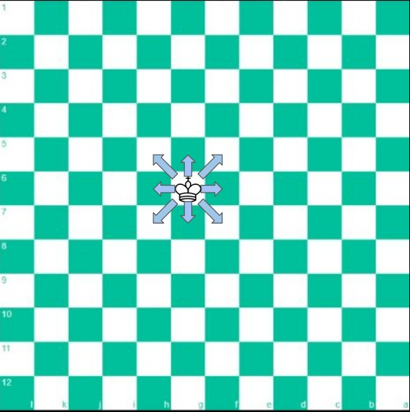
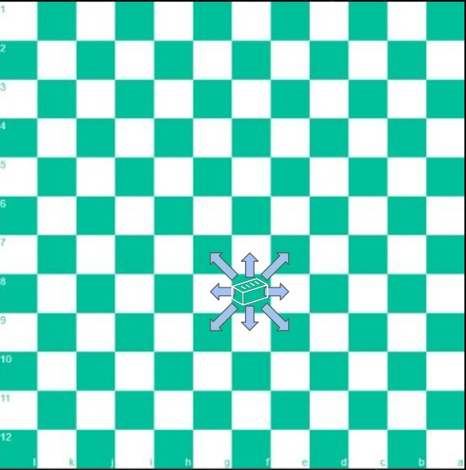

# AIBattleGround2023

This project is a result of the AI Battleground Zagreb 2023 hackathon. The project finished joint first place for a prize money of 800€. Changes have been made for better presentability of the results.

## The Task
The task at hand was to create a bot that will play a chess variation with custom rules.

## The Game
The game has the following rules that vary from chess:
* 12x12 dimension
* There is no chess, you have to capture the opposing king
* There are two phases to a game
 * In phase 1 of the game you put all the pieces on the board
 * In phase 2 you start moving the pieces like in regular chess
 * Pieces in the back rank do not have to be positioned to some fixed rule but can be put in any order

## The Pieces
We have a number of new pieces with new rules.

### Drunken Pawn (amount: 12)

* Moves diagonally (like in the image) either one or two steps
* Captures only pieces in front of him
* Is stationary once he reaches the end of the board (cannot turn into another piece)

### King (amount: 1)

* Moves regularly (like in normal chess)
* Once he is captured the game is over

### Queen (amount: 2)

* Moves regularly like a normal queen
* Always has to go to the maximum possible tile (either going to the edge of the board, stopping one short of own pieces or capturing an opposing piece)

### Brick (amount: 1)

* Moves like the king
* Cannot be captured nor otherwise destroyed
* Cannot capture other pieces itself

### Bishop (amount: 2)

* Moves regularly like a normal bishop
* If he is captured, al diagonal neighbors are also captured (except for kind and brick)

### Crazy Horse (amount: 2)

* Moves 3 ahead and 1 to the side (instead of 2+1 normally)

### TopG (amount: 2)

* Moves like a regular rook
* If he captures a piece, any (opposing or not) piece behind it will also be captured (except for the brick)

### Lethal Sniper (amount: 1)

* Can move 2 tiles in any non-diagonal direction (without jumping other pieces)
* Stays in places if capturing another piece

### Kamikaze (amount: 1)

* Can move 2 tiles in any diagonal direction (allowed to jump other pieces)
* If he captures a piece, kills himself (and vanishes from the board) and non-diagonal neighbors (regardless of color)

https://drive.google.com/drive/folders/1ILj53JZHr4Tn6v6PQRTJOtGcIvqSbm2n?usp=sharing
